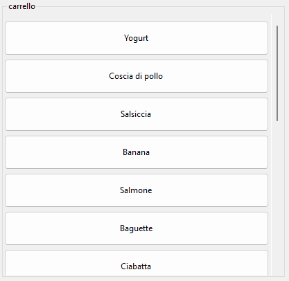

# Cassa
abbiamo creato un gestionale di cassa in una windows Form  che funziona tramite un barcode Reader connesso via usb al computer

# Scansione
quando si scansiona un barcode viene aggiunto un elemento

se non si dispone di un barcode usb si può utilizare il simulatore nella sezione simulazione

## Prodotti 

quando si scansiona un prodotto viene aggiunto nel carello

## Carte fedeltà

tramite il pulsante o la shourtcut f4 si può passarare alla scansione di una carta.

ogni carta fedeltà ha uno sconto correllato

nello scontrino poi verra riportato il nome del cliente

# carrello

quando scansioni un barcode di un prodotto viene cercato tra tutti i prodotti in elenco e viene aggiunto nel menù laterale

## eliminazione di un prodotto

quando si preme con il tasto destro il prodotto viene eliminato dal carello.

## informazioni di un prodotto

quando invece si preme con il tasto sinistro si vedono le informazioni del prodotto.

## prodotto alcolico

quando si inserisce un prodotto alcolico il programma chiede al cassiere se il cliente è maggiorenne

se il cliente viene identificato come minorenne ogni volta viene fatto un controllo 

in caso contrario viene aggiuto il prodotto senza problemi

# scontrino

quando si fisnisce con n cliente si può emettere uno scontrino sia tramite il pulsante che tramite la shortcut R5

## stampante

tramite questa opzione il programma stampa lo scontrino sulla stampante predefinita su windows

*nel  caso questa opzione può essere disabilitata
per essere visualizata in una messagebox

## file .txt

quando si emette uno scontrino viene SEMPRE salvato in un file di testo nella cartella del programma in scontrini/annoMeseGiornoOreMinutiSecondi.txt

# Gestione """"database""""

nelle impostazioni è possibile gestire tutti i prodotti e le carte

queste modifiche rigangono solo nella attuale sessione

## gestione prodotti
in questa schermata si vedono tutti prodotti presenti nel nostro negozio
 
si possono selezinare prodotti ed eliminarli

si può creare un prodotto generico

## gestione carte
in questa schermata si vedono tutte le carte dei clienti

si possono selezionare ed eliminare

si può creare una carta

# Display Arduino

tramite la comunicazione seriale cominichiamo con un arduino con collegato un display in modo di vedere i prodotti acquistati e il totale del carrello

# UML

# shortcut